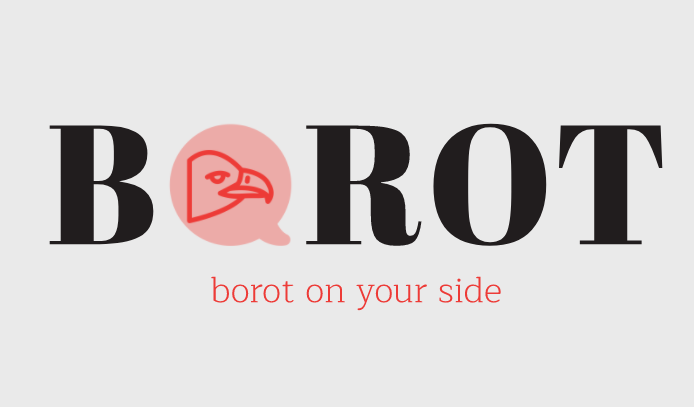

# borot


Implementation of NLP/NLU & other Deep Learning to create a chat bot

## Instructions
* Download NER model weight following this [link](https://drive.google.com/file/d/14jZElk4UlQp4u3-EHRX2eJ4uBUYgye3n/view?usp=sharing)
* Unzip the weight model and put in the folder ```borot/lib/borot_ai/BiLSTM_CRF```
* Install dependencies by typing
```
pip3 install -r requirements.txt
```
* Run the app by typing
```
python3 app.py
```

## To talk to Borot, 
* Make POST request to **/user** endpoint to initalize a new user with following data (JSON format only)
```
REQUEST:
{
	"first_name" : "Donal",
	"last_name" : "Trump",
	"email" : "president@us.com"
}
RESPONSE:
"Welcome to Borot"
```
* Make POST request to **/ask** endpoint to talk to Borot with the raw query (JSON format only)
```
REQUEST:
{
	"query" : "How are you"
}
RESPONSE:
{
    "response": {
        "Entities": {
            "geo": [
                "who"
            ],
            "nat": [
                "am"
            ],
            "per": [
                "i"
            ]
        },
        "Intent": "pto_request_status",
        "Relevant_info": null
    },
    "status_code": 200
}
```
